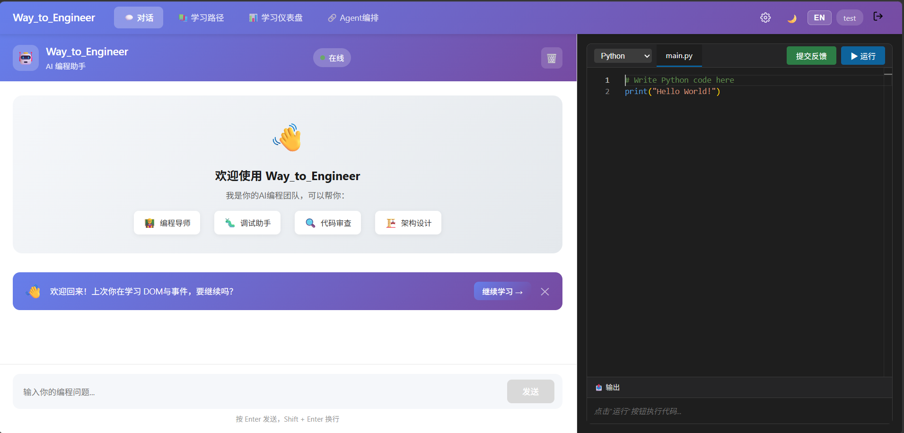
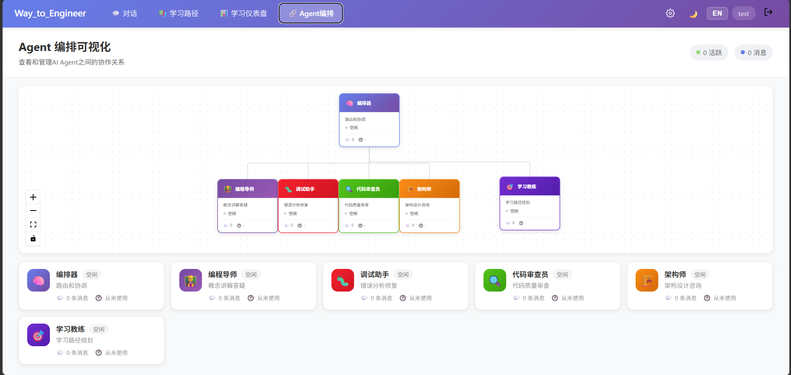
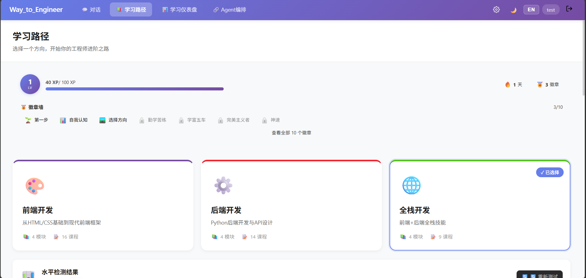
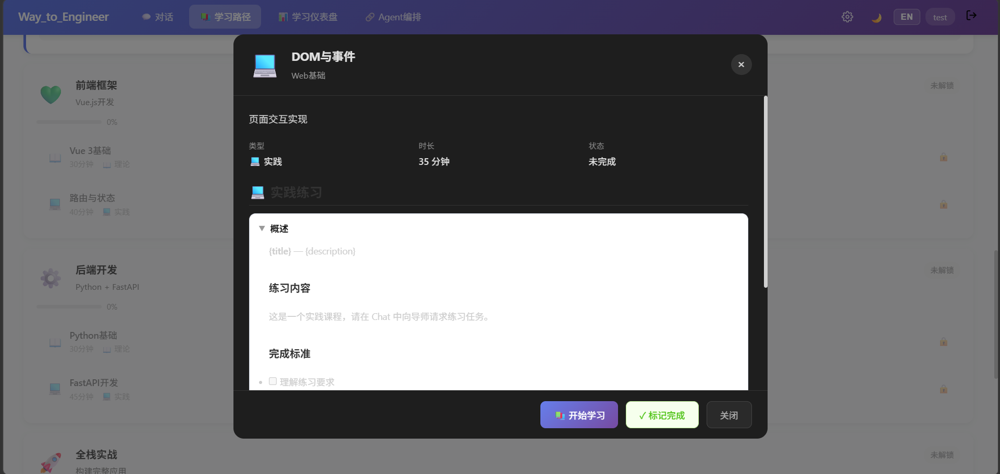
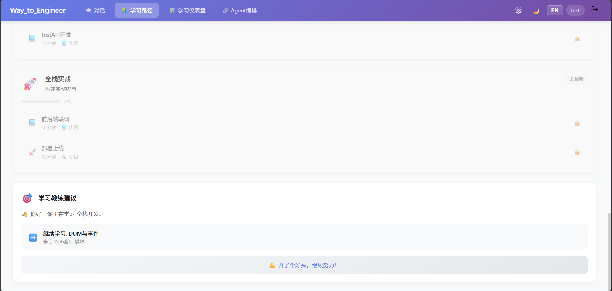
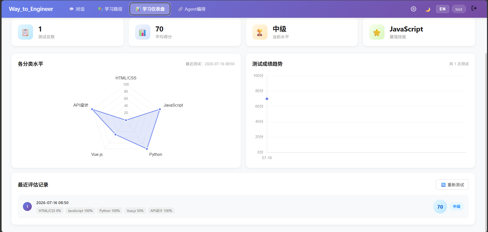
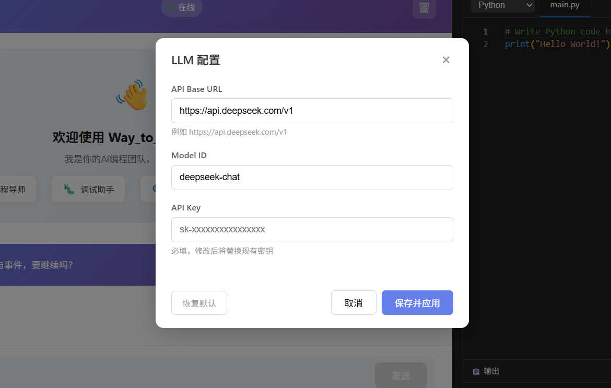

# Way to Engineer

> AI 辅助编程学习平台 — 多 Agent 协作，交互式代码练习

<div align="center">
  
</div>

---

## 简介

Way to Engineer 是一个 AI 驱动的编程学习平台。用户通过与多个 AI Agent 对话来学习编程，每个 Agent 扮演不同角色，覆盖从概念讲解到代码审查的完整学习闭环。

---

## 特性预览

### 🤖 多 Agent 智能对话

自动路由到最合适的 AI 角色——编程导师讲解概念、调试助手分析错误、审查员评估代码质量、架构师设计方案、学习教练规划路径。对话中可嵌入交互式测验和代码练习，边学边练。

<div align="center">
  
  
</div>

### 📚 结构化学习路径

支持前端、后端、全栈三条学习路径，每节课包含概念讲解、代码示例和练习测验。完成课程后自动解锁下一课，学习进度和提交记录持久化保存。

<div align="center">
  
  
  
</div>

<div align="center">
  
</div>

### ⚙️ 灵活配置

运行时切换 LLM 配置（API Base URL、Model ID、API Key），无需重启服务。同时支持暗色主题和中英文界面切换。

<div align="center">
  
</div>

### 更多功能

- **交互式代码运行** — 聊天中的代码块可一键执行，右侧 Monaco 编辑器提供完整的编码环境
- **练习反馈** — 写完练习代码后可提交给 AI 审查，获得教学性反馈
- **水平评估** — AI 生成测验题目，评估用户当前水平并推荐学习起点
- **游戏化** — XP 经验值、连续学习天数、徽章系统

---

## 技术栈

| 层 | 技术 |
|---|---|
| 前端 | Vue 3 + TypeScript + Vite |
| 后端 | FastAPI + Python 3.10+ |
| AI 框架 | hello-agents（轻量 LLM Agent 封装） |
| 代码编辑器 | Monaco Editor |
| 持久化 | JSON 文件存储 |
| 代码执行 | 子进程沙箱（subprocess + 安全过滤） |

---

## 快速开始

### 前置要求

- Python 3.10+
- Node.js 18+
- 一个 LLM API Key（默认支持 DeepSeek，也可配置其他 OpenAI 兼容接口）

### 1. 克隆并配置后端

```bash
git clone <repo-url>
cd Way_to_Engineer/backend
python -m venv venv
source venv/bin/activate   # Windows: venv\Scripts\activate
pip install -r requirements.txt
cp .env.example .env       # 编辑 .env 填入 API Key
```

### 2. 启动后端

```bash
python run.py
```

后端运行在 `http://localhost:8000`。

### 3. 启动前端

新开一个终端：

```bash
cd frontend
npm install
npm run dev
```

前端运行在 `http://localhost:5173`，Vite 自动代理 `/api` 到后端。

### 4. 开始使用

浏览器访问 `http://localhost:5173`，输入用户名即可开始。

---

## 项目结构

```
Way_to_Engineer/
├── backend/
│   ├── app/
│   │   ├── agents/           # AI Agent（导师 / 调试 / 审查 / 架构 / 教练）
│   │   ├── api/routes/       # API 路由
│   │   ├── models/           # 数据模型
│   │   ├── services/         # 业务服务
│   │   └── config.py         # 配置管理
│   ├── data/                 # 用户数据（不纳入版本控制）
│   └── requirements.txt
├── frontend/
│   ├── src/
│   │   ├── components/       # 组件（CodeEditor / QuizWidget 等）
│   │   ├── views/            # 页面
│   │   ├── stores/           # Pinia 状态管理
│   │   └── locales/          # 中英文国际化
│   └── package.json
├── image/                    # 项目截图
└── README.md
```

---

## 配置说明

### 环境变量（`.env`）

| 变量 | 说明 | 默认值 |
|---|---|---|
| `DEEPSEEK_API_KEY` | DeepSeek API 密钥 | — |
| `DEEPSEEK_MODEL_ID` | 模型名称 | `deepseek-chat` |
| `DEEPSEEK_BASE_URL` | API 地址 | `https://api.deepseek.com/v1` |
| `LLM_TIMEOUT` | LLM 请求超时（秒） | `60` |
| `HOST` | 后端监听地址 | `0.0.0.0` |
| `PORT` | 后端端口 | `8000` |

### 运行时 LLM 配置

登录后在导航栏点击齿轮图标 ⚙️，可在页面中直接修改 LLM 配置（Base URL / Model ID / API Key），修改后即时生效，无需重启服务。页面配置优先于 `.env` 文件。

---

## API 概览

| 方法 | 路径 | 说明 |
|---|---|---|
| POST | `/api/chat/` | 发送聊天消息，自动路由到对应 Agent |
| POST | `/api/code/execute` | 执行代码 |
| POST | `/api/code/submit` | 提交练习代码获取 AI 反馈 |
| GET/POST | `/api/settings/llm` | 获取 / 更新 LLM 配置 |
| POST | `/api/auth/login` | 用户名登录 / 注册 |
| GET | `/api/learning/paths` | 获取学习路径列表 |
| GET | `/api/gamification/profile` | 获取游戏化档案 |

完整 API 文档在服务启动后访问 `http://localhost:8000/docs`（Swagger UI）。

---

## License

MIT
